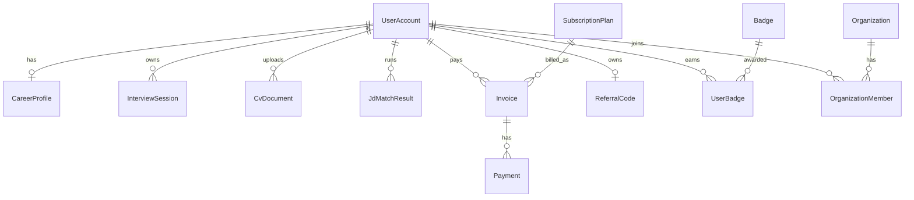

# HireMate — ERD (Full A–Z)

MVP entities: UserAccount, Role, CareerProfile, Question, InterviewSession, InterviewAnswer, CareerMemoryEvent.

## Full product entities

Additional tables: WaitlistEntry, ContactMessage, ContentPage, BlogPost, FaqItem, ResourceItem, PromoCode, SupportTicket, ReferralInvite.

Decimal money fields use precision (18,2).
