# HireMate — ERD (bản chốt T1)

Không tạo bảng mới. Cột **in đậm** là bổ sung T1.

```mermaid
erDiagram
    UserAccount ||--o| CareerProfile : "1-1 hồ sơ"
    UserAccount ||--o{ CvDocument : "có nhiều CV"
    CareerProfile }o--o| CvDocument : "ConfirmedCvDocumentId"
    UserAccount ||--o{ Invoice : "thanh toán"
    UserAccount ||--o{ InterviewSession : "luyện PV"
    UserAccount ||--o{ CareerMemoryEvent : "timeline"
    UserAccount ||--o{ RefreshToken : "phiên"
    UserAccount ||--o{ JdMatchResult : "match JD"
    UserAccount }o--o{ Role : "AspNetUserRoles"
    SubscriptionPlan ||--o{ Invoice : "gói"
    Invoice ||--o{ Payment : "giao dịch"
    InterviewSession ||--o{ InterviewAnswer : "câu trả lời"
    Question ||--o{ InterviewAnswer : "tùy chọn"
    Organization ||--o{ OrganizationMember : "thành viên"
    UserAccount ||--o{ OrganizationMember : "thuộc org"
    Badge ||--o{ UserBadge : "gán"
    UserAccount ||--o{ UserBadge : "đạt"
    UserAccount ||--o| ReferralCode : "mã GT"
    PromoCode ||--o{ Invoice : "áp dụng lúc checkout"

    UserAccount {
        guid Id PK
        string Email
        string FullName
        bool OnboardingCompleted "chốt = đã Confirm CV"
        bool IsPremium
        string CurrentPlanCode "T1: free|premium|combo"
        datetime PlanSelectedAt "T1: đã chọn gói"
        datetime CreatedAt
        datetime UpdatedAt
        datetime LastLogin
        bool IsDeleted
    }

    CareerProfile {
        guid Id PK
        guid UserId FK
        string DesiredIndustry
        string DesiredPosition
        string ExperienceLevel
        string University
        string Major
        int GraduationYear
        string Bio
        string HobbiesJson
        string SkillsJson "T1"
        string ExperiencesJson "T1"
        datetime ConfirmedAt "T1"
        guid ConfirmedCvDocumentId FK "T1 neo 1 CV"
        datetime CreatedAt
        datetime UpdatedAt
    }

    CvDocument {
        guid Id PK
        guid UserId FK
        string Source "T1 Upload|Wizard"
        string FileName
        string StoragePath
        string ContentType
        long FileSize
        string ExtractedText
        bool ParseSucceeded "T1 cửa Confirm"
        int FormatScore
        int KeywordsScore
        int ReadabilityScore
        int ProfessionalismScore
        int ReadinessScore "T1"
        int FitT1Score "T1 không phải JD"
        string AnalysisJson
        string AiProvider
        string WizardAnswersJson "T1"
        bool IsConfirmed "T1 max 1 per user"
        datetime ConfirmedAt "T1"
        datetime UploadedAt
        datetime AnalyzedAt
    }

    SubscriptionPlan {
        guid Id PK
        string Code
        string Name
        decimal PriceVnd
        int DurationDays
        string Description
        bool IsActive
    }

    Invoice {
        guid Id PK
        guid UserId FK
        guid PlanId FK
        string InvoiceNumber
        decimal AmountVnd
        string Status
        string PaymentMethod
        datetime CreatedAt
        datetime PaidAt
    }

    Payment {
        guid Id PK
        guid InvoiceId FK
        decimal AmountVnd
        string Provider
        string Status
        string TransactionRef
        datetime CreatedAt
    }

    InterviewSession {
        guid Id PK
        guid UserId FK
        string Industry
        string Position
        string Difficulty
        string Mode
        string Status
        int QuestionCount
        int OverallScore
        int ScoreS
        int ScoreT
        int ScoreA
        int ScoreR
        int ClarityScore
        string FeedbackSummary
        datetime StartedAt
        datetime CompletedAt
    }

    InterviewAnswer {
        guid Id PK
        guid SessionId FK
        guid QuestionId FK
        int OrderIndex
        string QuestionText
        string AnswerText
        bool Skipped
        int DurationSec
    }

    Question {
        guid Id PK
        string Category
        string Industry
        string RoleHint
        string Content
        string Hint
        string Difficulty
        bool IsActive
    }

    JdMatchResult {
        guid Id PK
        guid UserId FK
        guid CvDocumentId FK
        string JdText
        int OverallScore
        string ResultJson
        string AiProvider
        datetime CreatedAt
    }

    CareerMemoryEvent {
        guid Id PK
        guid UserId FK
        string EventType
        guid RefId
        string PayloadJson
        datetime CreatedAt
    }

    RefreshToken {
        guid Id PK
        guid UserId FK
        string Token
        datetime ExpiresAt
        datetime RevokedAt
    }

    Role {
        guid Id PK
        string Name
        string Description
        string Status
    }

    Organization {
        guid Id PK
        string Name
        string Type
    }

    OrganizationMember {
        guid Id PK
        guid OrganizationId FK
        guid UserId FK
        string Role
    }

    ReferralCode {
        guid Id PK
        guid UserId FK
        string Code
        int InviteCount
    }

    Badge {
        guid Id PK
        string Code
        string Name
    }

    UserBadge {
        guid Id PK
        guid UserId FK
        guid BadgeId FK
        datetime EarnedAt
    }

    PromoCode {
        guid Id PK
        string Code
        decimal DiscountPercent
        bool IsActive
        datetime ExpiresAt
    }
```

## Quan hệ T1 cần nhớ

1. `UserAccount` 1 — 1 `CareerProfile`
2. `UserAccount` 1 — N `CvDocument`
3. `CareerProfile.ConfirmedCvDocumentId` → **một** `CvDocument` (neo hồ sơ)
4. `CvDocument.IsConfirmed`: tối đa một bản `true` mỗi user
5. Gói: `UserAccount.CurrentPlanCode` (đọc nhanh) + lịch sử `Invoice`/`Payment`

## Bảng không vẽ chi tiết (CMS / public — không đổi T1)

`WaitlistEntry`, `ContactMessage`, `ContentPage`, `BlogPost`, `FaqItem`, `ResourceItem`, `SupportTicket`, `ReferralInvite`.
